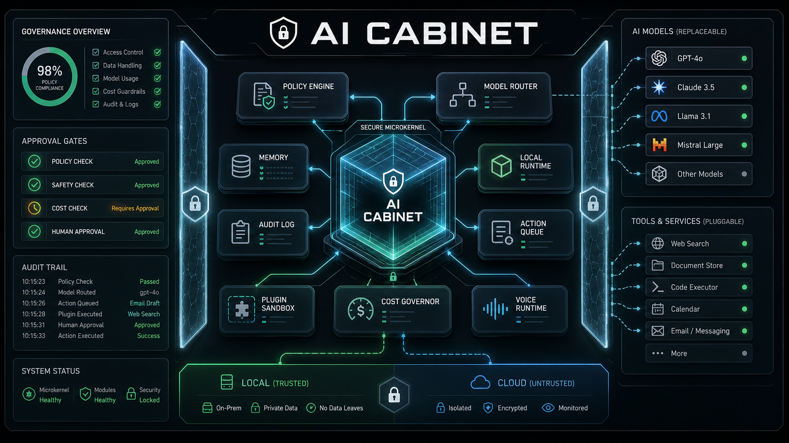

# AI Cabinet



AI Cabinet is a governed hybrid AI control plane: a microkernel runtime for
policy-bound, auditable, local-first AI execution.

It is not a chatbot, prompt wrapper, or automation script. AI Cabinet is the
trusted control layer between users, agents, models, tools, memory, budgets,
and external actions.

```text
CONTROL BEFORE AUTONOMY
```

## Why It Exists

Modern AI systems can generate, automate, and act faster than most organizations
can govern them. AI Cabinet addresses the missing layer between AI capability
and operational control: a runtime that classifies work, applies policy, routes
models, protects sensitive data, records audit evidence, and separates drafts
from approved actions.

## Execution Pipeline

```text
INPUT
  -> MULTIMODAL NORMALIZER
  -> STATE ENGINE
  -> PII DETECTOR
  -> DATA CLASSIFIER
  -> POLICY ENGINE
  -> TOKEN / COST GOVERNOR
  -> MODEL / VOICE / TOOL ROUTER
  -> LOCAL OR CLOUD RUNTIME
  -> PLUGIN SANDBOX
  -> PROVIDER ADAPTER
  -> OUTPUT GUARD
  -> ACTION QUEUE
  -> APPROVAL CENTER
  -> AUDIT LOG
  -> MEMORY UPDATE PROPOSAL
  -> HUMAN APPROVAL IF REQUIRED
```

## Platform Capabilities

| Subsystem | Purpose |
| --- | --- |
| Gateway | Accepts governed text, voice, image, file, browser, email, calendar, and plugin tasks. |
| PII Layer | Detects and masks personal data, secrets, phone numbers, emails, names, and IBAN-like values. |
| Classifier | Determines data class, risk level, task type, and routing implications. |
| Policy Engine | Enforces YAML governance before model calls or action proposals. |
| Cost Governor | Estimates tokens and cost, enforces per-request, daily, monthly, user, and agent limits. |
| Model Router | Routes work across OpenAI, Gemini, Ollama/local, manual mode, and enterprise adapter slots. |
| Local Runtime | Supports local-first execution paths, Ollama status, local model inventory, and offline fallback. |
| Output Guard | Scans model output for PII leakage, dangerous instructions, and unauthorized action claims. |
| Action Queue | Converts external actions into drafts, approval records, no-op execution records, or rollback states. |
| Approval Center | Separates model/agent proposals from human authority. |
| Audit Layer | Records request, risk, data class, policy, provider, model, token, cost, status, and action metadata. |
| Memory Engine | Stores governed operational memory and learning proposals that require approval. |
| Plugin Sandbox | Validates plugin manifests, permissions, forbidden actions, and allowed data classes. |
| Agent Registry | Defines controlled agents with roles, instructions, permissions, budgets, tools, memory scope, and risk level. |
| Evidence Layer | Stores source metadata, confidence, verification status, URL, timestamp, and citation. |
| Observability | Records latency, runtime health events, blocked actions, policy violations, and provider decisions. |

## Governance Contract

AI Cabinet does not treat AI autonomy as the default.

Agents may draft, analyze, classify, route, critique, and propose. They may not
publish, delete, send, merge, release, alter durable memory, change policy, or
execute external actions without an approval record.

Sensitive work is local-first. Public and low-risk tasks may use cloud models
when policy permits. Personal, confidential, secret-bearing, or high-risk work
is masked, blocked, routed local-only, or converted into an approval-gated draft
depending on policy.

## Current Release Status

This repository is a public MVP of the AI Cabinet control-plane architecture. It
is suitable for developer review, governance architecture discussion, local
demos, and early open-source collaboration.

It is not yet a hardened enterprise deployment. Before production use, replace
the development secrets vault with a managed KMS, add production AuthN/AuthZ,
deploy an append-only audit store, and run connector workers inside hardened
runtime isolation.

## Quick Start

### Windows

```powershell
cd backend
python -m venv .venv
.\.venv\Scripts\activate
pip install -r requirements.txt
copy .env.example .env
python -m uvicorn main:app --reload --port 8000
```

### macOS / Ubuntu

```bash
cd backend
python3 -m venv .venv
source .venv/bin/activate
pip install -r requirements.txt
cp .env.example .env
python -m uvicorn main:app --reload --port 8000
```

Open:

```text
http://127.0.0.1:8000
```

Set `ADMIN_API_TOKEN` in `backend/.env` before using administrative Control
Center panels such as audit, actions, memory, secrets, config, agents, evidence,
and observability. The browser UI includes an Admin token field.

## Docker

```bash
cp backend/.env.example backend/.env
docker compose up --build
```

Open:

```text
http://127.0.0.1:8000
```

## Environment

```env
OPENAI_API_KEY=
OPENAI_MODEL=gpt-4.1-mini
GEMINI_API_KEY=
GEMINI_MODEL=gemini-2.0-flash
APP_NAME=AI CABINET v0.2
ADMIN_API_TOKEN=change-me-before-public-demo
TOKEN_LIMIT_PER_REQUEST=8000
SESSION_COST_LIMIT=1.00
DAILY_COST_LIMIT=5.00
MONTHLY_COST_LIMIT=100.00
DAILY_TOKEN_LIMIT_PER_USER=50000
LOCAL_ONLY_MODE=false
EMERGENCY_STOP=false
OLLAMA_BASE_URL=http://127.0.0.1:11434
```

## Repository Structure

```text
backend/
  main.py
  cabinet/
    actions.py
    agent_registry.py
    approval_center.py
    budget_governor.py
    classifier.py
    config.py
    database.py
    evidence.py
    forecasting.py
    identity.py
    local_runtime.py
    memory_engine.py
    multimodal.py
    observability.py
    output_guard.py
    pii.py
    pipeline.py
    plugin_sandbox.py
    policy.py
    providers.py
    router.py
    secrets_vault.py
    schemas.py
    state_engine.py
    tokens.py
config/
  policy.yaml
  model_routing.yaml
frontend/
  index.html
  app.js
  styles.css
plugins/
  */manifest.yaml
docs/
  repository-presentation-architecture.md
scripts/
  Windows, Ubuntu, and macOS autostart helpers
tests/
  governance pipeline tests
```

## API Surface

| Area | Endpoints |
| --- | --- |
| Runtime | `POST /submit`, `GET /health`, `GET /state/{request_id}` |
| Governance | `GET /config/policy`, `GET /config/model-routing`, `GET /approvals`, `GET /actions` |
| Audit | `GET /audit`, `GET /observability/events` |
| Memory | `GET /memory/layers`, `POST /memory/proposals/{id}/approve`, `POST /vector-memory/search` |
| Agents | `GET /agents`, `POST /agents` |
| Plugins | `GET /plugins` |
| Local Runtime | `GET /local-runtime/status`, `POST /local-runtime/models/{model}/load` |
| Forecasting | `POST /forecasts`, `GET /forecasts`, `POST /forecasts/{id}/outcome` |
| Voice / Multimodal | `GET /voice/status`, `GET /multimodal/status` |

Administrative endpoints require `X-AI-Cabinet-Admin-Token` when
`ADMIN_API_TOKEN` is configured.

## GitHub Manager Agent

`github_manager_agent` is registered by default for governed repository work.
It may prepare issues, pull request plans, review summaries, CI diagnostics,
branch plans, and release notes. It may not push, merge, delete branches,
publish releases, close issues, change repository settings, or handle secrets
without an approval record.

## Testing

```bash
cd backend
python -m pytest ../tests
```

CI runs the same governance test suite through GitHub Actions.

## Autostart

Windows:

```powershell
powershell.exe -ExecutionPolicy Bypass -File .\scripts\install_autostart.ps1
```

Ubuntu:

```bash
chmod +x scripts/*.sh
./scripts/deploy_unix.sh
./scripts/install_ubuntu_autostart.sh
```

macOS:

```bash
chmod +x scripts/*.sh
./scripts/deploy_unix.sh
./scripts/install_macos_autostart.sh
```

## Roadmap

| Layer | Direction |
| --- | --- |
| Runtime | Managed local model workers, GGUF serving, GPU scheduling, and offline profiles. |
| Data | PostgreSQL, pgvector, retention policies, and append-only audit storage. |
| Governance | Policy tests, signed policies, dual-control approvals, and governance review UI. |
| Connectors | Signed connector workers for GitHub, email, calendar, CRM, Teams, Slack, and Notion. |
| Security | KMS-backed secrets, RBAC, session auth, connector isolation, and supply-chain scanning. |
| Observability | OpenTelemetry, SIEM export, budget dashboards, and policy violation reporting. |
| Enterprise | SSO, tenant isolation, compliance retention, model risk management, and eval pipelines. |

## Open Source

AI Cabinet is released under the MIT License. See `CONTRIBUTING.md`,
`SECURITY.md`, and `CODE_OF_CONDUCT.md` before opening public issues or pull
requests.
