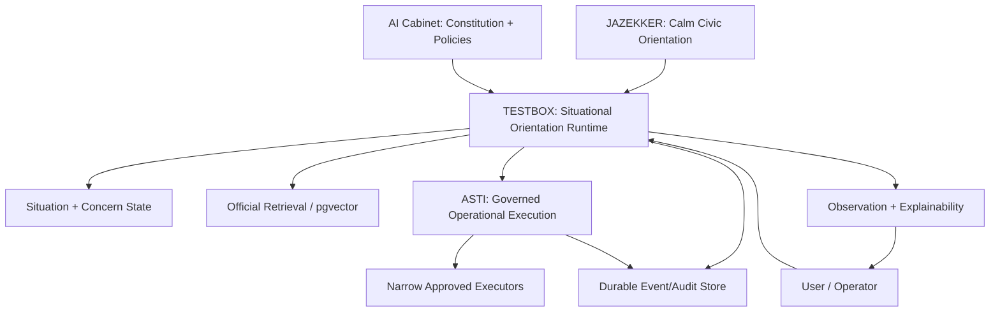

# ASTREB TESTBOX v0.3: Situational Orientation & Governance Runtime

## Status

This document is the target architecture and implementation blueprint for the
next TESTBOX and ASTI evolution. It is not a claim that PostgreSQL, Redis,
pgvector, LangGraph, WebSocket streaming or the vNext ASTI state model are
already deployed.

Current implemented baseline:

- Orientation Core routing with role, skill, policy and constitution exposure;
- bounded LegalBox, BusinessBox, DocumentBox, LetterBox and ASTI Action modes;
- ASTI Telegram approval gate with queue, execution protection and audit;
- JSON/JSONL MVP storage intended for single-process deployment.

## 1. Architecture

### Purpose

TESTBOX v0.3 evolves the working governed orientation MVP into a situational,
event-driven runtime. It does not add a catalogue of scripted cases. It adds a
universal layer that models what a situation means for a human before selecting
bounded specialist handling.

```text
JAZEKKER = calm civic orientation surface
TESTBOX = situational orientation and governance runtime
ASTI = governed operational execution layer
AI Cabinet = constitutional and policy authority
```

Core principle:

```text
orientation first
governance second
execution third
audit always
```

### Target Pipeline

```text
message
-> conversation context resolver
-> text normalization
-> intent detection
-> domain interconnection graph
-> situational modeling
-> human concern modeling
-> governance and risk classification
-> orientation strategy selection
-> mode and role assignment
-> route decision
-> answer or governed action proposal
-> audit and state persistence
```

The current v0.2 runtime remains a valid incremental baseline:

```text
context -> normalization -> intent -> domain graph -> mode -> governance -> route -> answer
```

v0.3 inserts the situation, concern and decision-orientation stages without
weakening current approval, source, audit, or human-review rules.

## 2. Situational Orientation Engine

### Responsibility

The `Situational Orientation Engine` derives an operational model of the user's
situation. A domain states where a question belongs. A situation states why it
matters, what may change, and which safe next step is useful.

### Output Model

```json
{
  "situation_id": "uuid",
  "summary": "User is considering an employment arrangement with uncertain hours.",
  "signals": ["nulurencontract", "offer", "Netherlands candidate"],
  "affected_domains": [
    "employment_contract",
    "income_stability",
    "benefits_interaction",
    "worker_rights"
  ],
  "operational_implications": [
    "variable monthly income",
    "schedule unpredictability",
    "need to check minimum-call-pay and notice rules"
  ],
  "risk_trajectory": ["accept_contract", "income_variation", "benefits_recalculation"],
  "confidence": 0.84,
  "inference_limits": ["benefits status not supplied", "residence status not supplied"]
}
```

### Example

Input:

```text
мне предлагают нулевой контракт что это значит
```

Situational output:

```text
topic: proposed zero-hours employment contract
likely situation: user is deciding whether to accept unstable work terms
implications:
- uncertain schedule
- income planning difficulty
- minimum-call and notice rights
- possible effect on benefits if applicable
not inferred:
- actual eligibility for benefits
- residence consequences without status facts
orientation strategy: explain + risk map + practical questions to ask employer
```

### Boundary

The engine may infer plausible implications. It must mark inference as
inference, not fact. It must not diagnose distress, manipulate decisions, or
pretend to know absent legal, financial, migration, or family facts.

## 3. Runtime Memory Model

### Goal

Memory preserves continuity and unresolved orientation work, not an
uncontrolled transcript archive.

### Session State

```json
{
  "session_id": "text",
  "topic": "zero-hours employment offer",
  "normalized_terms": ["nulurencontract"],
  "current_intent": "explanation",
  "active_situation_id": "uuid",
  "unresolved_concerns": [
    "income predictability",
    "contract cancellation terms"
  ],
  "orientation_strategy": "risk_map",
  "selected_mode": "LegalBox Mode",
  "jurisdiction_candidate": "Netherlands",
  "active_policies": ["source_governance", "human_review"],
  "last_safe_next_step": "ask for contract terms in writing",
  "pii_storage": "not_stored"
}
```

### Persistence Tiers

| Tier | Data | Storage | Retention |
| --- | --- | --- | --- |
| Ephemeral | active request, temporary parsing | Redis runtime state | minutes/hours |
| Session | topic, unresolved concerns, mode, jurisdiction | PostgreSQL | configurable |
| Evidence | audit events, approvals, executed actions | PostgreSQL append-only | policy-led |
| Retrieval | approved public source chunks/embeddings | PostgreSQL + pgvector | source-led |
| Sensitive | raw PII/documents | isolated encrypted storage only when needed | minimal |

### Memory Events

- `SITUATION_STATE_CREATED`
- `SITUATION_STATE_UPDATED`
- `CONCERN_ADDED`
- `CONCERN_RESOLVED`
- `ORIENTATION_STRATEGY_CHANGED`
- `MEMORY_READ_FOR_CONTINUITY`
- `MEMORY_WRITE_RESTRICTED`

## 4. Human Concern Modeling

### Purpose

The `Human Concern Mapper` identifies the practical problem the user is trying
to solve. It is operational, not therapeutic.

### Concern Object

```json
{
  "concern_type": "income_uncertainty",
  "basis": ["zero-hours contract proposal", "meaning requested"],
  "user_decision": "whether to accept or negotiate terms",
  "avoidance_goal": "unexpected loss of predictable income",
  "desired_outcome": "understand implications before agreeing",
  "confidence": 0.73,
  "requires_confirmation": true
}
```

### Valid Concern Categories

- understanding_before_decision
- financial_exposure
- deadline_or_loss_of_rights
- employment_instability
- compliance_burden
- document_obligation_uncertainty
- external_action_consequence
- safety_or_liability_exposure

### Restrictions

- Do not infer emotions as facts.
- Do not use concern predictions to persuade.
- Do not expand personal profiling.
- Do not persist sensitive inferred traits.
- Phrase output as practical implications and questions.

## 5. Domain Interconnection Graph

### Graph Model

The domain graph is directed and typed:

```text
domain node --relationship--> domain node
```

Relationship types:

- `requires_compliance_with`
- `may_affect`
- `creates_obligation_in`
- `requires_source_from`
- `may_trigger_review_in`
- `depends_on_fact_about`

### Examples

```text
employment_contract
  --may_affect--> income_stability
  --may_affect--> benefits_interaction
  --requires_source_from--> worker_rights

battery_manufacturing
  --requires_compliance_with--> eu_product_compliance
  --creates_obligation_in--> producer_responsibility
  --requires_compliance_with--> environmental_permits
  --may_affect--> insurance
  --may_affect--> logistics
  --may_affect--> investment_structure
```

### Storage Target

Initially store graph definitions as versioned structured configuration.
Persist per-request graph projections as JSONB. Use pgvector for semantic
retrieval of sources and precedent orientation patterns, not as the source of
governance truth.

## 6. Event-Driven Governance Runtime

### Services

```text
FastAPI Gateway
  -> LangGraph Orientation Workflow
  -> PostgreSQL state/audit store
  -> Redis event bus and transient locks
  -> pgvector retrieval index
  -> WebSocket observation stream
  -> ASTI execution service
```

### LangGraph Nodes

```text
intake
context_resolver
normalization
intent_detection
domain_graph_builder
situation_modeler
concern_mapper
governance_classifier
strategy_selector
mode_role_selector
retrieval
answer_composer
action_proposal
approval_gate
audit_commit
memory_commit
```

Graph state must contain structured values only; prompts are implementations of
specific nodes, not the architecture itself.

### Event Stream Contract

Events are append-only evidence. Redis distributes runtime notifications;
PostgreSQL is the durable system of record. WebSocket streams projections to
observation surfaces and must not become an execution input channel.

## 7. ASTI vNext Execution Model

### Goal

ASTI becomes a governed operational execution layer while preserving the
existing approval-only Telegram MVP.

### Action Envelope

```json
{
  "action_id": "uuid",
  "explicit_user_intent_ref": "message/event id",
  "executor": "telegram",
  "operation": "send_message",
  "payload": {"text": "approved text", "destination_ref": "owner_chat"},
  "consequences": ["external_message_sent", "irreversible_delivery"],
  "dependencies": ["valid_destination", "approved_payload"],
  "dry_run_result": {
    "valid": true,
    "warnings": [],
    "side_effects": ["message delivered externally"]
  },
  "rollback_strategy": "no_recall_available; send correction only with new approval",
  "status": "pending"
}
```

### State Machine

```text
proposed
-> validated
-> pending_approval
-> approved
-> execution_in_progress
-> executed | failed | reconciliation_required
```

The existing MVP `pending -> approved -> execution_in_progress -> executed`
remains compatible and can be migrated by treating `pending` as proposed and
validated for simple Telegram sends.

### Integrity Rules

- Generated answer text never directly creates execution.
- An action must point to explicit user/operator intent.
- Dry-run validates permission, destination, payload and consequence.
- Approval binds to a payload hash and executor.
- Changed payload invalidates approval.
- Every execution attempt produces durable audit.
- Rollback strategy must be recorded even when the action is irreversible.

## 8. Governance Explainability Layer

### Purpose

Explainability is an operator- and user-facing translation of governed
decisions, not a dump of classifier labels.

### Explainability Projection

```json
{
  "route_reason": "Document explanation requested; DocumentBox selected.",
  "situation_factors": ["contract text detected", "payment obligation present"],
  "governance_reason": "Legal consequences require jurisdiction-aware review.",
  "human_review_reason": "Material contract obligations may affect user rights.",
  "sources_used": [],
  "limitations": ["No governing law identified in the extracted fragment."],
  "next_step": "Choose whether to review payment terms or termination conditions."
}
```

### User Visibility

Show:

- what TESTBOX understood,
- why a route was chosen,
- what requires caution,
- available next steps,
- sources and limitations.

Hide:

- raw enum names,
- internal scoring,
- prompt text,
- unfiltered inferred attributes,
- executor secrets.

## 9. Updated Roles

Existing v0.2 roles remain. Add roles as bounded runtime responsibilities:

| Role | Purpose | Boundaries | Triggers | Runtime Behavior | Audit Visibility |
| --- | --- | --- | --- | --- | --- |
| Situational Analyst | Model real-world implications of the topic | No advice/diagnosis | domain identified | emit situation factors and inference limits | `SITUATION_MODELED` |
| Human Concern Mapper | Identify practical decision concern | No emotional profiling | situation has decision stakes | create bounded concern candidates | `CONCERNS_MAPPED` |
| Operational Risk Cartographer | Map consequence trajectory | No probability claims without basis | risk-bearing situation/action | connect effects and governance triggers | `RISK_TRAJECTORY_MAPPED` |
| Runtime Memory Coordinator | Preserve situation continuity | No raw PII persistence | multi-turn/session update | update bounded session state | `SITUATION_STATE_UPDATED` |
| Governance Explainability Narrator | Explain route and guardrails clearly | No raw internal trace disclosure | answer/audit projection | create readable rationale | `EXPLAINABILITY_PROJECTED` |
| Execution Integrity Supervisor | Validate ASTI consequences and dependencies | No execution authority without approval | external action proposal | dry-run, bind approval and audit | `ACTION_INTEGRITY_VALIDATED` |

## 10. Updated Skills

| Skill | Runtime Use | Output |
| --- | --- | --- |
| Situational Inference | derive operational meaning from topic | situation factors |
| Concern Mapping | identify user decision/avoidance goal | concern candidates |
| Operational Impact Modeling | assess consequences | impact list |
| Decision Orientation | choose safe explanatory structure | strategy |
| Dependency Mapping | link domain/action dependencies | typed graph edges |
| Governance Explainability | create human rationale | explanation projection |
| Multi-domain Correlation | expand connected domains | graph projection |
| Runtime Continuity | reuse bounded state | continuity reference |
| Action Consequence Awareness | describe external side effects | consequence/dry-run metadata |

## 11. Updated Policies

| Policy | Trigger | Enforcement |
| --- | --- | --- |
| Situational Inference Limits | inferred situation/concern exists | label inference, store confidence and limits, avoid personal profiling |
| Anti-Manipulation | decision guidance or vulnerable context | present options and implications; do not pressure or exploit |
| Execution Integrity | any ASTI action | explicit intent, dry-run, payload-bound approval, audit |
| Hallucination Boundaries | unsupported claim or missing source | state limitation, do not manufacture fact |
| Orientation vs Advice Separation | legal/financial/regulated matter | provide orientation; distinguish specialist advice |
| Governance Transparency | policy affects route/output | produce readable explanation |
| Audit Integrity | runtime mutation/execution attempt | append durable event with correlation id |
| Active Task Execution | attached document plus requested analysis | attempt analysis, report findings, missing data and limitations before next-step guidance |
| Runtime Accountability | failure, override or reconciliation | assign actor, reason and remediation state |

## 12. Updated Audit Schema

### Event Envelope

```sql
create table runtime_events (
  event_id uuid primary key,
  occurred_at timestamptz not null,
  stream_id text not null,
  session_id text,
  correlation_id uuid not null,
  causation_id uuid,
  actor_type text not null,
  actor_id text,
  event_type text not null,
  schema_version text not null,
  role_ids jsonb not null default '[]',
  skill_ids jsonb not null default '[]',
  policy_ids jsonb not null default '[]',
  jurisdiction_candidate text,
  risk_level text,
  situation_id uuid,
  action_id uuid,
  source_refs jsonb not null default '[]',
  payload jsonb not null,
  payload_hash text not null,
  pii_classification text not null default 'none'
);
```

### New Events

- `SITUATION_MODELED`
- `CONCERNS_MAPPED`
- `RISK_TRAJECTORY_MAPPED`
- `ORIENTATION_STRATEGY_SELECTED`
- `SITUATION_STATE_UPDATED`
- `EXPLAINABILITY_PROJECTED`
- `ACTIVE_TASK_ANALYSIS_ATTEMPTED`
- `ACTION_INTENT_VALIDATED`
- `ACTION_DEPENDENCIES_MAPPED`
- `ACTION_DRY_RUN_COMPLETED`
- `ACTION_INTEGRITY_VALIDATED`
- `APPROVAL_BOUND_TO_PAYLOAD`
- `EXECUTION_RECONCILIATION_REQUIRED`

### Audit Rule

No state mutation, approval, action proposal, execution attempt, override or
reconciliation may occur without a correlated durable event.

## 13. Anti-Patterns To Avoid

- One giant prompt pretending to be runtime architecture.
- New hardcoded scenario for every user wording.
- Emotional profiling presented as concern modeling.
- Frontend buttons that simulate successful execution.
- Hidden policy decisions or hidden source failures.
- Generated text sent to external tools.
- Approval applied to a payload that later changes.
- pgvector similarity treated as authoritative governance.
- WebSocket events used as commands.
- Unbounded transcript or PII retention.
- LegalBox presented as final legal advice.
- JAZEKKER optimized for outrage or compulsive engagement.

## 14. Production Risks

| Risk | Impact | Mitigation |
| --- | --- | --- |
| Over-inference about user situation | misleading guidance | inference limits, confidence, user correction |
| Incomplete official-source coverage | unsupported regulated claims | source governance and human review |
| Multi-worker duplicate execution | external side effects | transactional action claims and idempotency |
| Redis event loss | incomplete live observation | PostgreSQL durable event log is authority |
| PII leakage through embeddings/logs | privacy breach | masking, isolated storage, retention policy |
| Prompt drift changes governance behavior | inconsistent runtime | versioned constitution and policy tests |
| Manipulative decision framing | loss of trust | anti-manipulation policy and UX review |
| Document extraction error | wrong obligation reading | confidence/quality state and manual verification |

## 15. Orientation Philosophy

TESTBOX helps people orient inside complexity. It is neither a passive
information dump nor an autonomous decision maker.

```text
Meaning before route.
Situation before category.
Options before persuasion.
Sources before regulated conclusions.
Approval before external effect.
Evidence after every material step.
```

Good orientation:

- understands the question behind the wording,
- surfaces relevant implications without overclaiming,
- makes uncertainty usable,
- gives the human a practical next step,
- retains visible governance.

## 16. AI Runtime Constitution v2

The normative constitution is specified separately in:

```text
docs/ai-runtime-constitution-v2.md
```

It versions system duties, role boundaries, skill obligations, policy
enforcement and ASTI execution integrity without embedding these duties inside
UI labels.

## 17. UX Evolution Roadmap

### User Surface

1. Keep chat calm and human-readable.
2. Add a small "What I understood" orientation card.
3. Add situation/concern confirmation controls: correct, refine, proceed.
4. Add document review choices: summary, risks, dates, payment, response draft.
5. Show source/limitation note when regulated reasoning is active.

### Observation Surface

1. Live event timeline over WebSocket.
2. Situation map and domain graph projection.
3. Active roles, skills, policy and constitution version.
4. Approval/action integrity panel.
5. Audit replay/export view.

The user surface must not expose raw runtime enums; the observation surface may
show structured governance detail for authorized operators.

## 18. Backend Runtime Roadmap

| Phase | Deliverable | Technology |
| --- | --- | --- |
| v0.3.1 | situation/concern models and events in existing FastAPI runtime | FastAPI + JSONL compatibility |
| v0.3.2 | structured session state store and explainability projection | PostgreSQL |
| v0.3.3 | durable event store and WebSocket observation feed | PostgreSQL + Redis + WebSocket |
| v0.3.4 | semantic source retrieval adapters | PostgreSQL + pgvector |
| v0.3.5 | node-based orchestration migration | LangGraph |
| v0.3.6 | secure document/OCR pipeline and PII storage controls | worker + object storage |

## 19. Operational Governance Roadmap

1. Version Constitution v2 and policies in the audit stream.
2. Add operator correction of inferred situations/concerns.
3. Enforce source coverage thresholds for regulated output.
4. Add ASTI intent validation and dry-run before approval.
5. Bind approvals to payload hashes and consequence summaries.
6. Add reconciliation workflow for external side-effect uncertainty.
7. Introduce retention, privacy and signed audit-export controls.
8. Require deployment readiness review before multi-worker execution.

## 20. Long-Term Ecosystem Architecture



The ecosystem remains human-authorized:

```text
understand situations
-> preserve governance
-> explain routes and limits
-> control execution
-> maintain durable evidence
```

It must never become opaque, manipulative, or autonomous beyond approved
operational boundaries.

## First Implementation Slice

The next code increment should be deliberately narrow:

1. Add structured `SituationHypothesis`, `HumanConcernMap` and
   `OrientationStrategy` models to the current FastAPI runtime.
2. Insert situation and concern stages after the existing domain graph, while
   preserving all existing route, source, human-review and ASTI approval rules.
3. Emit `SITUATION_MODELED`, `CONCERNS_MAPPED` and
   `ORIENTATION_STRATEGY_SELECTED` through the existing audit compatibility
   layer.
4. Extend tests for zero-hours contract orientation, regulated manufacturing,
   short follow-up reuse, document explanation and external-action isolation.
5. Defer infrastructure migration until these semantics are stable; PostgreSQL,
   Redis, pgvector, WebSocket and LangGraph are later delivery phases.
